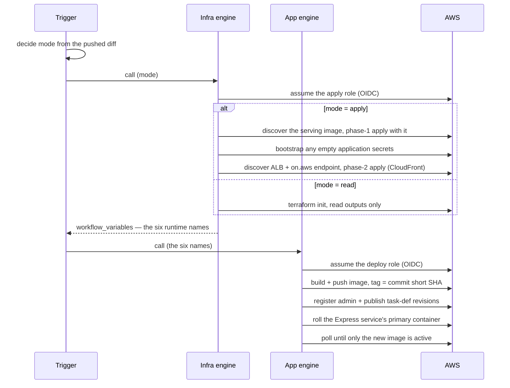
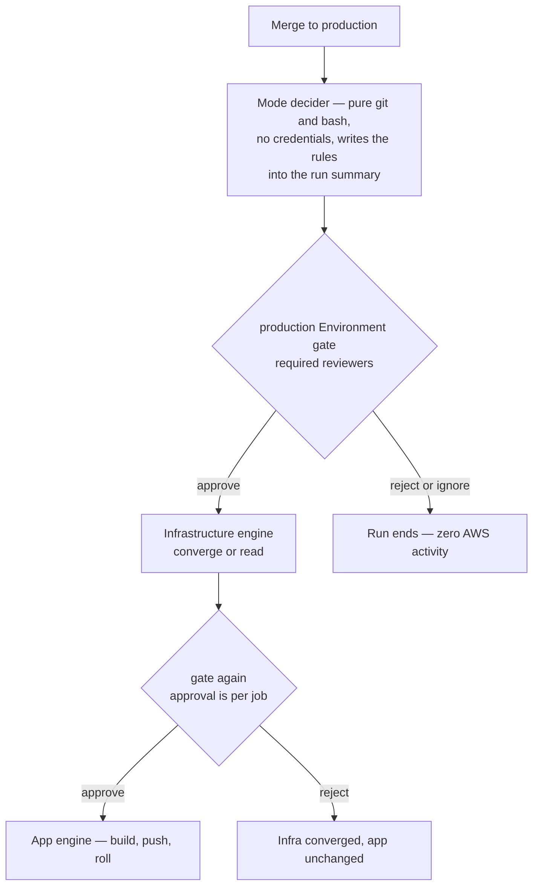

# Pipelines — PR to converged

Part of the [infrastructure reference](iac.md). Three entry points: a read-only plan preview on infrastructure PRs, and one composed deploy run per environment branch. There is one implementation of "converge the infrastructure" (`iac-deploy.yml`) and one of "ship the app" (`app-deploy.yml`); both are reusable engines with no triggers of their own, called in order by a thin per-environment trigger. A new environment adds a trigger, not a pipeline.

## The composed run

A trigger fires on every push to its branch (and on manual dispatch, with an optional plan-only box). It first decides a *mode* from the pushed diff — pure git, no credentials — then calls the engines:

| Mode | When | Infrastructure engine | App engine |
|---|---|---|---|
| `apply` | The push touched `infrastructure/terraform/**` or one of the three pipeline files; any non-plan-only dispatch; any push whose diff is unknowable | Two-phase converge | Runs |
| `read` | Every other push (app-only merges — most of them) | Init and read state outputs; changes nothing | Runs |
| `plan` | Plan-only dispatch | Plan, published to the run summary | Skipped |

**The infrastructure job always runs.** Skipping it on app-only merges looks obvious and does not work: a skipped job emits no outputs, so the app job would receive six empty names on exactly the merges that touch no infrastructure. Path-awareness gates the *mode*, never the job.

**Concurrency**: one group per trigger spans the whole composed run and queues rather than cancels — an interrupted apply leaves state locked and infrastructure half-converged. GitHub keeps at most one pending run per group; a superseded middle merge is safe because a later push contains its commits.

## A merge to `development`, end to end

**The image sandwich.** Terraform decides which image the task-definition *families* are registered with, and publish jobs `RunTask` the bare family name — so an infra apply must never feed the families a tag that is not in ECR. In steady state the infra engine discovers the image the service is already serving and applies with it (never moving the image forward, only refusing to move it backwards), then the app engine builds the new image and rolls the service exactly once. The engine **refuses to apply** if a live service exists but its image cannot be resolved, and likewise if state says CloudFront exists but the Express trio (ALB ARN, endpoint, security group) cannot be discovered — applying then would tear down the distribution and come back on a new domain. On greenfield the first apply registers a nonexistent placeholder, the service crash-loops for a few minutes, and the same run's app phase heals it; CloudFront may complete on a later run if the ALB is slow to surface.

**Nothing is written back into GitHub.** The six runtime names are read out of Terraform state at run time (`terraform output -json workflow_variables`) and handed to the app engine as workflow outputs. Writing them into Actions variables would need a hand-rotated PAT and would leave a second copy of the truth free to drift.

**Database content is sacred.** The module manages the RDS *instance*, never its contents; no workflow runs a migration, seed, or restore. The superadmin values only seed an account at first boot.

## The secret bootstrap (apply-mode runs only)

Phase 1 creates the Secrets Manager secrets as empty shells. Four hold credentials only MMGIS itself consumes, so the infra engine fills each one **the first time it finds it empty** and never touches one that carries a value. Design properties:

- Emptiness is decided from `describe-secret` **metadata** only — no CI role holds `GetSecretValue` anywhere, so CI can never read a secret value back.
- Values are diceware passphrases generated from the EFF large wordlist, downloaded at run time and verified against a pinned SHA-256 (a hash pin is as trustworthy as a vendored copy); on any download or hash failure the run goes red — there is no fallback to a weaker generator.
- Generated values flow through pipes straight into `put-secret-value`; they never land in a variable a trace could print.
- Two secrets are deliberately excluded: the Mapbox token (external, hand-set) and the DB password (RDS-managed, untouched).

## Plan previews on pull requests

`iac-plan.yml` runs on every PR touching `infrastructure/terraform/**` and posts one sticky comment per environment root, updated in place per push — the plan *is* the review artifact. Read-only by construction: it OIDC-assumes the dedicated plan role, plans with `-lock=false` so a preview can never contend with a real apply, and deliberately binds **no** GitHub Environment — an unbound job presents the `pull_request`-form OIDC subject the plan role's trust policy is written for, and binding one would both flip the subject and park a PR check behind production's reviewer gate (see [identity](iac-identity.md#oidc-subjects-environment-vs-pull_request)). It triggers on `pull_request`, never `pull_request_target`, because it effectively executes PR-authored Terraform. Two degrade paths stay green rather than red: missing configuration (pre-bootstrap) skips AWS and posts a comment naming exactly which values are absent, and fork PRs — which receive no OIDC token and no comment-writable token on a public repo — get a step-summary notice from a clearly named skipped job.

## Production: the gated trigger

Merging to `production` expresses intent; it does not deploy.

The gate lives in the **engines**, not the trigger: both engine jobs bind `environment: production`, and the binding is what asks for approval — so there is no path to AWS that bypasses it, manual dispatch included. Rules the trigger writes into every run summary:

- **Two clicks per run is expected.** Required-reviewer approval is per job, and the app job only reaches the gate after the infra job finishes. It is deliberately not "fixed": the binding also mints the OIDC subject the production roles trust and resolves the Environment-scoped values.
- **Approve the newest run only.** Runs parked at a gate sit outside the concurrency group ("waiting", not "in progress"), so stale parked runs accumulate; approving an older one deploys an older commit over a newer one.
- **No cross-environment image promotion.** Production builds its own image from the production-branch commit into production's own ECR repository. Development images are never promoted — not by workflow, not by hand.

The Environment's deployment-branch policy (#252) is load-bearing security, not hygiene: without it, any workflow on any branch could call the engines with `environment:` set and mint the trusted OIDC subject.

## Rollback and break-glass

App rollback is **re-running the last green composed run**: its image already sits in ECR under that commit's SHA, so the re-run re-registers the families and re-rolls the service onto exactly it (a run that decided `read` re-runs in `read` mode and applies nothing). Infrastructure rollback is a revert commit merged to the environment's branch — hand-editing state is not a rollback, it is losing track of what exists. On production, every path parks at the same gate. Break-glass — CI itself broken — is an operator assuming the apply role and running the hand-apply flow in the [infrastructure README](../infrastructure/README.md#rollback-and-break-glass); anything applied by hand is drift until a CI run converges on the same committed change.

## Legacy: `deploy-lean.yml`

The pre-composition pipeline still deploys the existing staging environment from hand-set repository variables (disjoint from the `IAC_*` Environment values, so neither pipeline can drive the other's environment). It is deliberately untouched; retiring it is an explicit later step, never a side effect.
