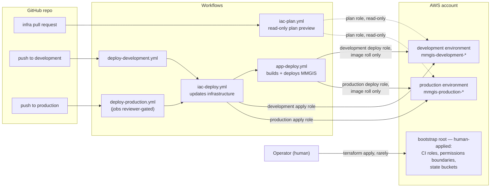

# Infrastructure & CI/CD — the map

MMGIS's **lean** deployment (`MMGIS_DEPLOYMENT_MODE=lean`) runs on AWS: 
- admin app as an ECS Express Mode service behind CloudFront
- RDS PostgreSQL supporting the admin app
- a short-lived publish task that turns missions into a standalone static dashboards 

IAC is done via Terraform and applied by Github Actions CI on merge. One reusable module describes a complete environment, and a small per-environment root fills in each environment's settings. The **full** deployment (upstream docker-compose default) uses none of this.

This file briefly explains the big picture and will link to more detailed docs on environments, pipelines, and identities. Operational how-tos (apply steps, verification commands) live with the code they operate — the [bootstrap README](../../infrastructure/terraform/bootstrap/README.md) and the [infrastructure README](../../infrastructure/README.md) — never here.

## The whole system

The Terraform is split into two roots, so that different access permissions can be given to each:

- **The bootstrap root** — run by a human, rarely. It creates the IAM roles CI runs as, the permissions boundaries that cap any role CI creates, and the S3 buckets that hold Terraform state. See [identity & containment](identity.md).
- **Everything else** — run by CI, using those roles. CI has no permission to modify anything the bootstrap root created — it can't edit its own credentials or grant itself more. Each environment branch (`development`, `production`) has a small workflow of its own that calls the same two shared workflows in order: one updates the AWS infrastructure to match the code, the other builds and deploys MMGIS to that infrastructure. If we later add a new environment, we only add another small workflow file that calls those same two — the deploy logic is written once and never duplicated. See [pipelines](pipelines.md).

## The documents

| Document | Question it answers |
|---|---|
| [aws-environments.md](aws-environments.md) | What exists in AWS per environment, how the module builds it, and where the app's secrets and images come from |
| [pipelines.md](pipelines.md) | What happens on a PR, on a merge to `development`, and on a merge to `production` — the shared workflows, run modes, approval gates, and rollback |
| [identity.md](identity.md) | Why any of those API calls are permitted — how CI authenticates to AWS without stored keys, and what stops it from granting itself more access |

Reading order for a newcomer: environments, then pipelines, then identity.

## Where values live

Two things in these docs are both called an environment.
- An **AWS environment** is a full copy of the deployment (development or production): the app, its database, and everything around them, with every resource named `mmgis-<env>-*`. The term is ours, not AWS's — both copies live in the same AWS account and VPC, and what separates them is that every credential's permissions are scoped to its own environment's name patterns
- A **GitHub environment** is a settings object in this repo that holds the AWS environment's secrets and variables, plus production's required-reviewers approval gate.

Each AWS environment has a GitHub environment with exactly the same name, and the names have to match: a workflow job that declares `environment: development` presents that name to AWS as part of its identity, and the AWS roles only trust the exact string. Renaming a GitHub environment breaks CI's ability to sign in to AWS.

Nothing account-identifying is committed as part of the code. Every value has exactly one home:

| Home | What lives there | Exact list |
|---|---|---|
| Files in git | all Terraform and workflow code; everything not account-identifying | the repo |
| GitHub environments | the deploy pipeline's five settings: the apply and deploy role ARNs (secrets) — the roles that can change AWS — plus region, state bucket, and the uncommittable Terraform inputs as one JSON value | `iac-deploy.yml` header |
| Repo-wide Actions settings | the plan preview's settings: the read-only plan role's ARN (secret) plus its own copies of region, state buckets, and Terraform inputs, name-suffixed per AWS environment. The write-capable role ARNs never exist at this scope — the plan job declares no GitHub environment, so this is all it can read, and all it needs. Also the legacy staging set read only by `deploy-lean.yml` | `iac-plan.yml` header; `deploy-lean.yml` header |
| AWS Secrets Manager | the secret values the running app consumes (session key, seed admin login, dashboards password, Mapbox token, database password) — injected into the containers, unreadable by CI | [aws-environments.md](aws-environments.md#secrets-who-sets-each-value) |
| Terraform state outputs | the non-secret names of what Terraform built (cluster, ECR repo, service, task families, admin URL) — read by the pipeline on every run instead of being stored anywhere in GitHub | the roots' `outputs.tf` |
