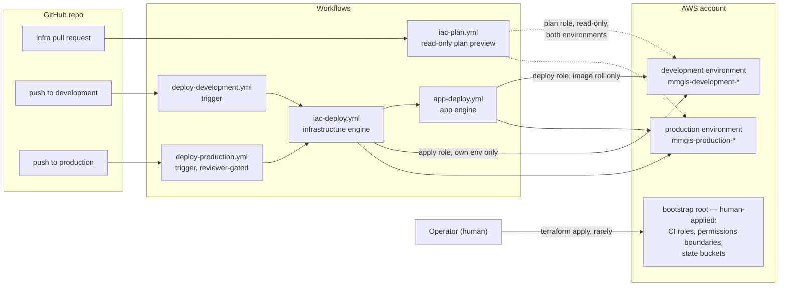

# Infrastructure & CI/CD — the map

*This page and its siblings describe the merged end-state; the pieces land across the current PR stack (#245 bootstrap, #199 environments, #246 plan previews, #247 engines, #248 secret bootstrap, #249 demo converge, #250 dashboard namespace, #251 production gate, with #252 configuring the GitHub side).*

MMGIS's **lean** deployment (`MMGIS_DEPLOYMENT_MODE=lean`) runs on AWS: the admin app as an ECS Express Mode service behind CloudFront, a short-lived publish task that turns a mission into a standalone static dashboard, and RDS PostgreSQL underneath. Everything is Terraform, applied by CI on merge; one reusable module describes a complete environment and thin per-environment roots instantiate it. The **full** deployment (upstream docker-compose default) uses none of this.

This page is the hub. It holds the whole-system picture and the where-values-live inventory; the three siblings hold the detail. Operational how-tos (apply steps, verification commands) live with the code they operate — the [bootstrap README](../infrastructure/terraform/bootstrap/README.md) and the [infrastructure README](../infrastructure/README.md) — never here.

## The whole system

The bootstrap root owns the identities every workflow assumes and the buckets all Terraform state lives in; the workflows never touch it.

Two planes, deliberately split:

- **The bootstrap root** — applied by a human, rarely. It owns the things CI must never own: the CI roles themselves, the permissions boundaries that cap CI-created roles, and the state buckets. See [identity & containment](identity.md).
- **Everything else** — applied by CI. Each environment branch (`development`, `production`) has a thin trigger workflow that calls two shared engines in order: converge the infrastructure, then ship the app. A new environment adds a trigger, not a pipeline. See [pipelines](pipelines.md).

## The documents

| Document | Question it answers |
|---|---|
| [environments.md](environments.md) | What exists in AWS per environment, how the module builds it, and where the app's secrets and images come from |
| [pipelines.md](pipelines.md) | What happens on a PR, on a merge to `development`, and on a merge to `production` — engines, modes, gates, rollback |
| [identity.md](identity.md) | Why any of those API calls are permitted — the two-root model, OIDC trust, the containment story, and the scoping honesty table |

Reading order for a newcomer: environments (the map), pipelines (the motion), identity (the trust).

## Where values live

Nothing account-identifying is committed. Every value has exactly one home:

| Home | Values | Notes |
|---|---|---|
| Committed in the repo | The module and roots, the backend `key`/`encrypt`/`use_lockfile`, all five workflows, the `mmgis-<env>-*` naming patterns, the wordlist hash pin | Everything reviewable in a PR; plans are the review artifact |
| GitHub Environment (one copy per environment; #252) | Secrets `IAC_APPLY_ROLE_ARN`, `IAC_DEPLOY_ROLE_ARN`; variables `IAC_AWS_REGION`, `IAC_TFSTATE_BUCKET`, `IAC_TFVARS` (JSON: `vpc_id`, `private_subnet_ids`, `rds_ca_bundle_base64`, `permissions_boundary`) | Binding the Environment is what resolves these *and* mints the OIDC subject the roles trust — one mechanism, both jobs |
| GitHub repo-level (plan preview only) | Secret `IAC_PLAN_ROLE_ARN`; variables `IAC_AWS_REGION`, `IAC_TFSTATE_BUCKET_<ENV>`, `IAC_TFVARS_<ENV>` | The plan job is deliberately Environment-unbound, so it cannot read Environment-scoped values |
| AWS Secrets Manager (`mmgis/<env>/...`) | `session-secret`, `superadmin-username`, `superadmin-password`, `dashboards-password` (CI-generated once, never overwritten), `mapbox-token` (hand-set external credential), plus the RDS-managed master secret | Terraform creates empty shells only; no secret value ever passes through Terraform state |
| Terraform outputs, read at run time | The six runtime names (`workflow_variables`: region, ECR repo, cluster, service, both task families), `admin_url`, the Express phase-2 handoff values | Never written back into GitHub — state is the only copy, so there is no second copy to drift |
| Legacy repo variables (staging) | `AWS_REGION`, `ECR_REPOSITORY`, `ECS_CLUSTER`, `ECS_SERVICE`, the task-family pair, secret `AWS_DEPLOY_ROLE_ARN` | Read only by the pre-composition `deploy-lean.yml`; disjoint from `IAC_*` by design so neither pipeline can drive the other's environment |
