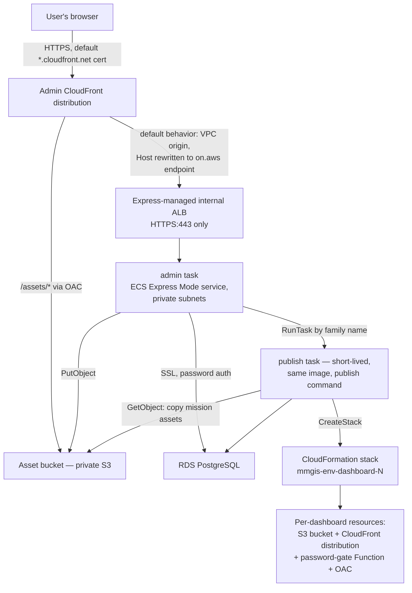

# AWS environments

An AWS environment is a full, self-contained copy of the MMGIS deployment — the app, its database, and everything around them. Two exist, development and production, and the term is ours, not AWS's: both copies live in the same AWS account and VPC, and what separates them is that every resource is named with the `mmgis-<env>-*` prefix (secrets use the path form `mmgis/<env>/...`) and every credential's permissions are scoped to its own environment's name patterns ([identity.md](identity.md)).

One reusable Terraform module (`infrastructure/terraform/modules/mmgis-environment/`) describes a complete environment; a small root under `environments/development/` and `environments/production/` calls it with that environment's settings.

## Topology (one environment)

The module builds:

- the ECS cluster and the admin Express Mode gateway service
- the `mmgis-<env>-admin` and `mmgis-<env>-publish` task definitions
- RDS PostgreSQL and its subnet group
- task security groups
- two log groups (`/ecs/mmgis-<env>-admin|publish`, pre-created because the execution roles deliberately omit `logs:CreateLogGroup`)
- five Secrets Manager secret shells
- an ECR repository
- the asset bucket, its OAC, and its bucket policy
- the CloudFront distribution and VPC origin
- the task, execution, and infrastructure IAM roles

Operator-provided prerequisites (VPC, subnets, boundary ARN, CA bundle) and where the resource settings originally came from are in the [infrastructure README](../../infrastructure/README.md).

## Building an environment takes two phases

ECS Express Mode does not export its internal ALB ARN or on.aws endpoint as Terraform attributes, and the CloudFront VPC origin needs both. So an environment is built (and updated) in two phases:

1. **Phase 1 — everything except CloudFront.** Cluster, service (which provisions its own internal ALB), task definitions, RDS, secret shells, ECR, asset bucket, IAM.
2. **Discovery** — the ALB ARN, the on.aws endpoint, and the ECS-managed ALB's security-group id are read from the now-running service.
3. **Phase 2 — the front door.** VPC origin, distribution, asset-bucket policy, and the one `:443`-from-VPC-CIDR ingress rule on the ECS-managed ALB security group.

The CI pipeline reads those values *before* phase 1, so in steady state phase 1 already has all three and everything applies in one pass; a separate phase-2 apply happens only on a brand-new environment or when the discovered values changed. By hand the discovery is two CLI calls documented in the [infrastructure README](../../infrastructure/README.md#apply-flow). Two CloudFront origin settings are required for the app to work at all: the origin `DomainName` must be the on.aws endpoint (it alone satisfies the ALB certificate's SNI and host-header rule), and the AllViewerExceptHostHeader origin-request policy plus the CachingDisabled cache policy are what let login, sessions, and WebSocket connections survive the proxy.

## Images and task definitions

An *image* is the packaged build of MMGIS: the app, its runtime, and every dependency, frozen into one runnable package by `docker build`. On every deploy, CI builds an image from the pushed commit, tags it with the commit's short SHA, and stores it in ECR (AWS's image storage). Everything that executes in an environment is a container started from an image, so "which image runs" means "which build of the app is live."

A *task definition* is ECS's saved recipe for running a container: image, CPU and memory, environment variables and secrets, log group, IAM roles. Saving one is called *registering* it (`aws ecs register-task-definition` — a pure write to ECS's catalog; nothing runs). Each registration becomes a new numbered *revision*, and the named series of revisions is a *family*. The module registers two families:

- **`mmgis-<env>-publish` — executed.** Each dashboard publish is a task the admin app launches from this family; ECS runs the newest revision, so whatever image it names is what the publish runs with.
- **`mmgis-<env>-admin` — reference only.** The admin app runs as the Express Mode service, which keeps its own internal copy of the container settings and never reads a task definition. This family is a synchronized copy for humans: a standard console page showing exactly what the service is configured to run.

Both copies stay correct because each kind of change has one writer:

- **Configuration** (environment variables, secrets, sizing) comes from Terraform. One set of module variables renders into both the task definitions and the service's internal settings, so a module change updates both in a single apply.
- **The image** comes from the deploy workflow. Each deploy registers a new revision of both families with the new image, then points the service at it. Terraform never moves the image: each apply reads the image the service is currently serving and re-records it (`deployed_image`), and the service's image field is excluded from Terraform's control so an apply never rolls the container.

Two consequences:

- On a brand-new environment nothing is serving yet, so the first apply registers a placeholder `:latest` tag that does not exist in ECR (CI only pushes commit-SHA tags). Tasks crash-loop for a few minutes until the same run's app phase pushes a real image. Expected, and self-healing.
- Family names are shared across the whole region, which is why they carry the environment prefix: without it, a production deploy would register a revision that development's publish lookup silently picks up.

## Secrets: who sets each value

Terraform defines secret *existence*, never values — a value in the configuration would be a value in the state file.

| Secret (`mmgis/<env>/...`) | Value comes from | Injected as |
|---|---|---|
| `session-secret` | CI secret bootstrap (generated once) | `SECRET`, admin task |
| `superadmin-username` / `superadmin-password` | CI secret bootstrap | Seed pair, admin task — seeds the account at first boot only |
| `dashboards-password` | CI secret bootstrap | Publish task; baked into each dashboard's password-gate Function |
| `mapbox-token` | A human, once per environment | `MAPBOX_TOKEN`, admin task — an external credential CI can never invent |
| database admin password (`rds!db-...`) | RDS itself — it creates and rotates this secret; Terraform and CI never see it | `DB_PASS` via the `:password::` JSON-key selector; host/port/user/name ride as plain env values |

The database password exists in exactly one place, so there is no second copy to drift or leak. The admin username must be `postgres` (a `scripts/init-db.js` startup constraint, enforced in the module — RDS calls this the "master" user, which is where the `rds_managed_master_secret_arn` output gets its name). Both environments set `secret_recovery_window_days = 0` so a destroy/re-apply cycle never collides with a ghost name.

## Dashboard stacks: app-created, environment-namespaced

When someone publishes a dashboard, the app — not Terraform — creates its resources (bucket, CloudFront distribution, password gate) as one CloudFormation *stack*: a bundle of resources AWS creates and deletes as a unit. Terraform's only involvement is granting the tasks permission over stack and bucket names starting with `mmgis-<env>-dashboard-`.

That prefix is built independently in three places, and all three must stay character-identical:

- the app builds it from the `MMGIS_ENVIRONMENT` environment variable (`scripts/lib/cfn-template.js`)
- the module pins its IAM grants to the same string (`local.dashboard_prefix`)
- the module injects the matching `MMGIS_ENVIRONMENT` into both tasks

Changing the prefix strands every dashboard published under the old one: the permissions stop matching, so the app can no longer update or delete those stacks.

Two rules that follow:

- **The environment name is capped at 11 characters.** CloudFormation names each dashboard's bucket `<stack-name>-dashboardbucket-<suffix>`, and S3 caps bucket names at 63 characters — a longer environment name would truncate exactly the part the IAM patterns match on. `development` (11) and `production` (10) fit. Both the module and the app validate the cap, so a bad name fails immediately with a clear message instead of as a confusing AccessDenied at publish time.
- **An unset `MMGIS_ENVIRONMENT` falls back to the legacy shared prefix `mmgis-dashboard-`**, which the hand-built staging environment keeps.

## Keeping the demo mission in sync at boot

The demo mission's configuration is defined by a committed file, `mission-profiles/generated/full-demo-mission.json`. Nobody edits it directly: a developer who changes its inputs re-runs the config generator (`node scripts/generate-mission-config.js full-demo`) and commits the regenerated file, and CI fails any PR where the committed file does not match what the generator produces from its inputs. When an environment sets `OVERWRITE_DEMO_MISSION=true`, `scripts/init-db.js` compares the database's demo mission against that file on every boot:

- missing → created from the file
- identical → left untouched
- different → one new configuration version is added, with all prior versions kept in history

A deploy is what delivers an updated file: the new image contains it, and rolling the service boots new containers, which run the comparison — so merging a config change to `development` updates the demo mission with no extra step.

No other mission is ever read or written. If the step fails, it logs the error and lets boot continue — a broken demo mission must never take the app down. The flag is off by default and only development sets it; production content is never touched automatically.

## Full vs lean, one image

| | **Full** (upstream default) | **Lean** (this reference) |
|---|---|---|
| Ships via | GHCR images + docker-compose (upstream) | This pipeline → ECR → ECS Express Mode |
| Sidecars | Bundled (STAC, TiTiler, …) | None — external services by URL |
| Uses `infrastructure/` | No | Yes |
| Mode switch | `MMGIS_DEPLOYMENT_MODE` unset/`full` | `MMGIS_DEPLOYMENT_MODE=lean` — a runtime ECS env var, never a build-arg; the `Dockerfile` is shared and unmodified |
