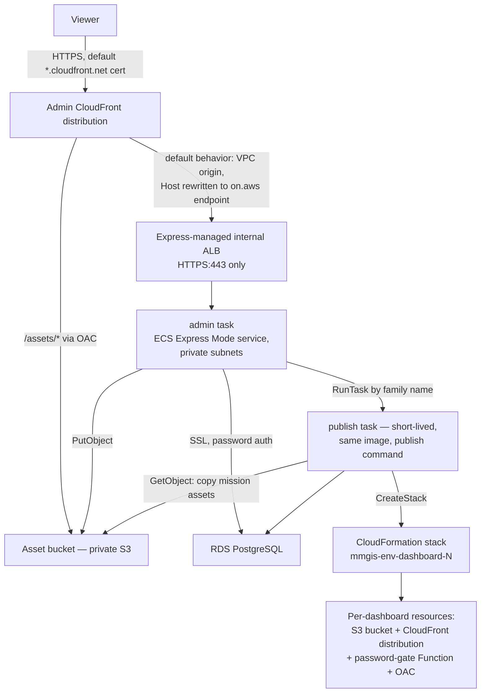

# Environments — what exists in AWS

Part of the [infrastructure reference](README.md). One reusable Terraform module (`infrastructure/terraform/modules/mmgis-environment/`) describes a complete environment; thin roots under `environments/development/` and `environments/production/` instantiate it. Every resource carries the `mmgis-<env>-*` name prefix (secrets use the path form `mmgis/<env>/...`), which is what the [identity model](identity.md) scopes against.

## Topology (one environment)

The module builds: the ECS cluster and admin Express Mode gateway service; the `mmgis-<env>-admin` / `mmgis-<env>-publish` task definitions; RDS PostgreSQL + subnet group; task security groups; two log groups (`/ecs/mmgis-<env>-admin|publish`, pre-created because the execution roles deliberately omit `logs:CreateLogGroup`); five Secrets Manager secret shells; a per-environment ECR repository; the asset bucket + OAC and policy; the CloudFront distribution + VPC origin; and the task/execution/infrastructure IAM roles. Operator-provided prerequisites (VPC, subnets, boundary ARN, CA bundle) and the recipe-JSON provenance story are in the [infrastructure README](../../infrastructure/README.md).

## A two-phase converge

ECS Express Mode does not export its internal ALB ARN or on.aws endpoint as Terraform attributes, and the CloudFront VPC origin needs both. So an environment converges in two phases:

1. **Phase 1 — everything except CloudFront.** Cluster, service (which provisions its own internal ALB), task definitions, RDS, secret shells, ECR, asset bucket, IAM.
2. **Discovery** — the ALB ARN, the on.aws endpoint, and the ECS-managed ALB's security-group id are read from the now-running service.
3. **Phase 2 — the front door.** VPC origin, distribution, asset-bucket policy, and the one `:443`-from-VPC-CIDR ingress rule on the ECS-managed ALB security group.

The CI pipeline discovers *before* phase 1, so in steady state phase 1 already has all three values and converges everything in one apply; a separate phase-2 apply happens only on greenfield or when the discovered values changed. By hand the discovery is two CLI calls documented in the [infrastructure README](../../infrastructure/README.md#apply-flow). Two origin details are load-bearing: the origin `DomainName` must be the on.aws endpoint, which alone satisfies the ALB cert's SNI and host-header rule; and the AllViewerExceptHostHeader origin-request policy plus CachingDisabled cache policy are what let login, Postgres-backed sessions, and WebSocket upgrades survive the proxy.

## Images: CI decides, Terraform records

Terraform never chooses which image runs — every pipeline apply hands the module the currently serving image as `deployed_image`, so re-registered task-definition revisions point at reality rather than a stale placeholder. On a brand-new environment nothing is serving yet, so the families point at a placeholder `:latest` that does not exist in ECR (CI pushes commit-SHA tags only) and the tasks crash-loop until the same run's app phase pushes a real image. Express Mode services are not task-definition driven — the app engine rolls the service via its primary container — but both families stay registered: `mmgis-<env>-publish` is genuinely load-bearing (the Deployments backend `RunTask`s it by bare family name, which resolves to the latest revision) and `mmgis-<env>-admin` is the human-auditable source of truth the primary container mirrors. Task-definition families are region-global, which is why they carry the environment prefix: without it a production deploy would register a revision that development's publish-by-family flow silently picks up.

## Secrets: shells, one managed master, one external

Terraform defines secret *existence*, never values — a value in the configuration would be a value in the state file.

| Secret (`mmgis/<env>/...`) | Value comes from | Injected as |
|---|---|---|
| `session-secret` | CI secret bootstrap (generated once) | `SECRET`, admin task |
| `superadmin-username` / `superadmin-password` | CI secret bootstrap | Seed pair, admin task — seeds the account at first boot only |
| `dashboards-password` | CI secret bootstrap | Publish task; baked into each dashboard's password-gate Function |
| `mapbox-token` | A human, once per environment | `MAPBOX_TOKEN`, admin task — an external credential CI can never invent |
| RDS-managed master secret (`rds!db-...`) | RDS itself — created and rotated by RDS, never seen by Terraform or CI | `DB_PASS` via the `:password::` JSON-key selector; host/port/user/name ride as plain env values |

The DB password exists in exactly one place, so there is no app-shaped copy to drift or leak. The master username must be `postgres` (a `scripts/init-db.js` bootstrap constraint, enforced in the module). Both environments set `secret_recovery_window_days = 0` so a destroy/re-apply cycle never collides with a ghost name.

## Dashboard stacks: app-created, environment-namespaced

Dashboards are published at runtime by the app, one CloudFormation stack per dashboard — Terraform never creates them, it only grants against them. The stack-name prefix is composed in lockstep at three points that must stay character-identical: the app (`scripts/lib/cfn-template.js`) builds `mmgis-<env>-dashboard-` from the `MMGIS_ENVIRONMENT` env var, the module's `local.dashboard_prefix` pins the IAM grants to the same string, and the module injects the matching `MMGIS_ENVIRONMENT` into both tasks. Changing the prefix orphans every stack published under the old one. The environment name is capped at **11 characters**: CloudFormation's generated dashboard bucket name (`<stack-name>-dashboardbucket-<suffix>`) must fit S3's 63-character limit without truncating the portion the `mmgis-<env>-dashboard-*` IAM match depends on. `development` (11) and `production` (10) fit, and both the module and the app validate the cap so a bad name fails loudly instead of as an AccessDenied at publish time. An unset `MMGIS_ENVIRONMENT` yields the legacy shared prefix `mmgis-dashboard-`, which the hand-built staging environment keeps.

## Boot-time demo-mission convergence

Development environments can opt in to `OVERWRITE_DEMO_MISSION=true`: on every boot, `scripts/init-db.js` converges the one demo mission to its committed blueprint (`mission-profiles/generated/full-demo-mission.json`) — missing → created, identical → untouched, different → one new config version appended with prior versions kept in history. No other mission is ever read or written, and the step logs and swallows its own failures so boot never fails because of it. Dev-only; defaults off.

## Full vs lean, one image

| | **Full** (upstream default) | **Lean** (this reference) |
|---|---|---|
| Ships via | GHCR images + docker-compose (upstream) | The composed pipeline → ECR → ECS Express Mode |
| Sidecars | Bundled (STAC, TiTiler, …) | None — external services by URL |
| Uses `infrastructure/` | No | Yes |
| Mode switch | `MMGIS_DEPLOYMENT_MODE` unset/`full` | `MMGIS_DEPLOYMENT_MODE=lean` — a runtime ECS env var, never a build-arg; the `Dockerfile` is shared and unmodified |
