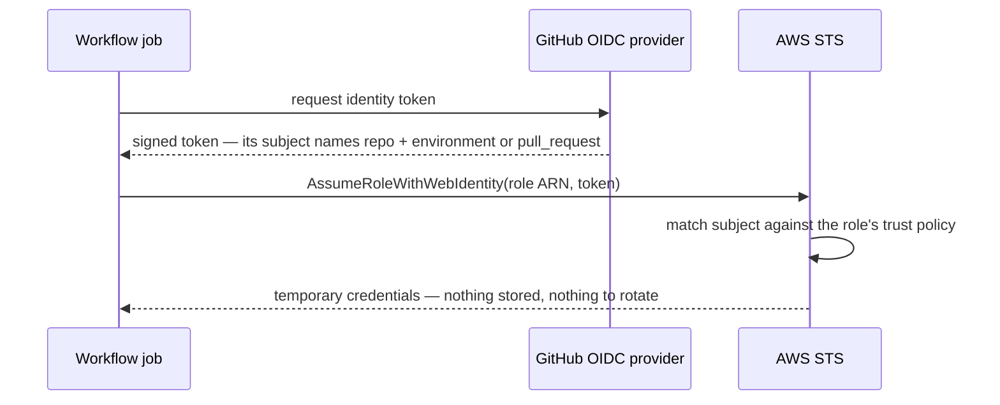

# Identity — why the calls are permitted

Part of the [infrastructure reference](README.md). How to actually run and verify the bootstrap root lives in [its README](../../infrastructure/terraform/bootstrap/README.md); this page explains the *why*.

## Why two Terraform roots

Everything in `infrastructure/terraform/` is run by CI, except one root: **bootstrap**, run by a human, rarely. The split exists because CI cannot be allowed to control the things that would let it grant itself more access — its own credentials (the CI roles) or the buckets that record what those roles are (its state). The role CI runs as creates IAM roles as part of building an environment, and a role that can create roles can, unchecked, create a more powerful one. The bootstrap root creates the identities and the guardrails; the environment roots create everything else.

### State

One state bucket per environment and nothing shared: no CI role's policy names any bucket but its own, so applying one environment can never touch another's state. The bootstrap root's own state sits in a third bucket that no CI role can touch at all, because that state describes the CI roles themselves.

Day one has a chicken-and-egg: the bootstrap root's state belongs in a bucket that root creates. The first apply therefore runs on local state and is immediately migrated into the new bucket with `terraform init -migrate-state` — the migration is mandatory, because a laptop-resident state file is exactly the locked-up knowledge this repo bans. Procedure in the [bootstrap README](../../infrastructure/terraform/bootstrap/README.md).

**If state is lost or leaked.** State holds no secret values — the environment module creates secret *shells* whose values are set outside Terraform, and the database admin password is created and rotated by RDS itself, never seen by Terraform. A leaked state file is an inventory, not a credential. Total state loss is survivable but tedious (re-import the long-lived resources); bucket versioning makes it unlikely, since every state revision stays recoverable and a clobbered write is a rollback rather than an outage. All state buckets carry versioning, SSE, a full public-access block, and `prevent_destroy`.

## The five roles

Five IAM roles that GitHub Actions jobs can sign in to, all created by the bootstrap root. There are no stored AWS keys anywhere — every workflow authenticates by presenting a short-lived token, signed by GitHub, to AWS:

| Role | Purpose | Trusted by |
| --- | --- | --- |
| `mmgis-terraform-apply-development` | Infrastructure apply, dev | `repo:NASA-IMPACT/MMGIS:environment:development` + account root |
| `mmgis-terraform-apply-production` | Infrastructure apply, prod | `repo:NASA-IMPACT/MMGIS:environment:production` + account root |
| `mmgis-terraform-plan` | Read-only PR plan previews (both envs) | `repo:NASA-IMPACT/MMGIS:pull_request` |
| `mmgis-development-github-deploy` | Update the running app image only, dev | `repo:NASA-IMPACT/MMGIS:environment:development` |
| `mmgis-production-github-deploy` | Update the running app image only, prod | `repo:NASA-IMPACT/MMGIS:environment:production` |

The bootstrap root also creates the three state buckets, the two permissions boundaries (`mmgis-ci-role-boundary-<env>`, attached to every CI-created role), and the KMS key that encrypts the database admin password's secret.

### OIDC subjects: environment vs pull_request

The identity a GitHub Actions job presents to AWS (its OIDC "subject") depends on whether the job declares a GitHub environment (the `environment:` key in the workflow):

- Jobs **with** a GitHub environment present `repo:<owner/name>:environment:<env>`. The infrastructure and app-deploy workflows declare `environment:` at job level — that declaration is also what makes production wait for required reviewers — so their roles trust the environment-form subject. Renaming a GitHub environment breaks CI's ability to sign in to these roles.
- Jobs **without** one present `repo:<owner/name>:pull_request`. The plan job deliberately declares none: declaring a GitHub environment would change its subject to the environment form and make a mere PR check wait for production's reviewer approval. Fork PRs on a public repo receive no OIDC token at all, so outside contributors get no plan preview — accepted, and the workflow says so with a neutral notice.

The apply roles can additionally be signed in to by the account's own IAM users (`sts:AssumeRole` from the **account root**), so an operator can run the scratch verification and deploy by hand when CI itself is broken. This grants nothing by itself — the operator still needs their own `sts:AssumeRole` allow — so it adds no new way in from outside the account. The plan and deploy roles do not carry it; nothing requires a human to hold them.

## What stops CI from granting itself more

Two mechanisms, solving different halves of "CI creates roles safely":

**The permissions boundary caps what CI-created roles can do.** The apply role may only create a role if it attaches exactly its environment's boundary — `iam:CreateRole` is denied otherwise — so an uncapped role cannot be created at all. A boundary grants nothing by itself: a capped role's effective permissions are the intersection of its own policy with the boundary, and the boundary's content is written from what the five runtime roles legitimately need.

There is one boundary per environment. A shared boundary would have to allow the union of both environments' needs, so the development apply role could create a role whose own policy reads production secrets and pulls production images — and the cap would permit it. With one boundary per environment, a role created by the development pipeline can only ever reach development resources.

**The escalation fence stops CI from editing the five roles GitHub signs in to.** A boundary cannot express this rule: boundaries constrain what a role *does*, not who may sign in to it (its trust policy) — and the risk is precisely "CI rewrites who may sign in to the deploy role". So the fence is an explicit `Deny` in the apply role's policy, and a `Deny` overrides every `Allow`:

- every IAM write against the five roles is denied (reads survive, for debugging during an incident)
- the boundary policies themselves cannot be edited or re-versioned by either apply role
- detaching the boundary from any role in the account is denied

As a second layer of protection, the five roles are also named *outside* the `mmgis-<env>-*` name pattern the apply roles hold IAM write permissions over (except the deploy roles, whose `mmgis-<env>-github-deploy` names must keep that shape — those are covered by the fence explicitly).

## Per-service scoping: which is which

Least privilege is only honest if you say where it stops. Three patterns are in play, forced by what AWS actually supports:

| Pattern | Where and why |
| --- | --- |
| Name prefix `mmgis-<env>*` | ECR repositories, ECS clusters/services, log groups, IAM role names, RDS instances and subnet groups, asset buckets — everything AWS lets you name |
| `Resource: "*"` + exact action allowlist | CloudFront distributions / VPC origins / origin access controls (AWS-generated ids), security groups (AWS-generated ids; the VPC id is an uncommitted input), `iam:CreateServiceLinkedRole` (scoped by the service name it may create a role for instead) and `logs:DescribeLogGroups` (a list call, authorized against no single log group), `ecs:RegisterTaskDefinition` / `ecs:DescribeTaskDefinition` / `ecs:DeregisterTaskDefinition` (no resource-level authorization), `ecr:GetAuthorizationToken`, and the `Describe*` read surface. The boundary backstops CI-created roles |
| Path style `mmgis/<env>*` | Secrets Manager names and the state-object keys inside each environment's state bucket — a **different** convention from the `mmgis-<env>-*` resource prefix, which every policy must carry explicitly or the operations fail |

Deliberate exceptions:

- **CI can write secrets but never read them.** `secretsmanager:PutSecretValue` exists on the apply roles for the CI secret bootstrap, which writes a generated value into a freshly created shell. The apply roles also hold `CreateSecret` and `TagResource` on the `rds!*` names RDS uses for its managed master secret: AWS attributes that create to whoever calls `CreateDBInstance`, so the database cannot be built without it, even though RDS alone fills and rotates the value. `GetSecretValue` is absent from *every* CI role: neither plan nor apply ever needs to read a secret value, and neither should be able to leak one.
- **The database admin password's secret.** RDS creates it and names it `rds!db-<id>` — nothing environment-distinguishing in the name — so the runtime boundary scopes it by the `aws:rds:primaryDBInstanceArn` tag RDS sets, the only per-environment handle. Its encryption key is a bootstrap-created one (`alias/mmgis-master-secret`), shared by both environments, not the account's default Secrets Manager key: an AWS-managed key's policy delegates only metadata actions to IAM, so no grant on the apply role would let it create a database whose managed secret uses that key. The apply roles hold describe/encrypt/decrypt and `kms:CreateGrant` (conditioned on `kms:GrantIsForAWSResource`) on the shared key, plus a bare `kms:DescribeKey` on the default Secrets Manager key — creating the database describes that key too, and refuses without it, though nothing beyond that metadata read reaches it. The plan role may only describe the shared key, and the runtime roles may only decrypt through Secrets Manager (`kms:ViaService`), which is the only way the password reaches a task.
- **No object-level delete on asset buckets.** The apply roles manage asset-bucket *configuration* only, so destroying an environment that has served uploads requires emptying its bucket by hand first. That friction is the point: deleting user data stays a deliberate human act.
- **Scratch allowance.** Development patterns deliberately also match `mmgis-development-scratch-*` / `mmgis/development-scratch/*`, so the scratch verification (a throwaway test build of the whole environment — see the bootstrap README) runs under the *real* dev apply role. That is why wildcards have no separator before them, and why asset-bucket grants need two patterns. No asset or scratch pattern matches a `-tfstate-` bucket name — each apply role's only state access is its own environment's bucket and key prefix, so a scratch run can never reach state.
- **The Express infrastructure role's need-set is AWS's, not ours.** `mmgis-<env>-express-infrastructure` carries one policy — the AWS managed `AmazonECSInfrastructureRoleforExpressGatewayServices` — and ECS assumes it to build the gateway's ALB, security groups, certificate, autoscaling alarms, and log group. The boundary has to cap that whole surface or service creation fails partway through, with an error naming the boundary rather than the missing action. It caps the load-balancing, EC2, ACM, and autoscaling services by wildcard, so an AWS-side extension of the managed policy cannot break provisioning. The alarm and log-group writes are enumerated instead and pinned to this account and region — ECS names both resources, so that is as narrow as the cap can get, and a `logs:*` cap would let a mis-granted role read every log group in the account. The service-linked-role grant is narrower still: it names the two services a role may be created for. Fine-grained scoping is still real — it lives in the managed policy, whose `AmazonECSManaged` tag conditions hold the role's writes to resources ECS itself created.
- **Dashboard resources are environment-namespaced in lockstep with the app.** Dashboards are published by the application at runtime (a CloudFormation stack per dashboard) under the `mmgis-<env>-dashboard-` prefix; the IAM patterns pin to that exact string, and the [environments page](aws-environments.md#dashboard-stacks-app-created-environment-namespaced) covers the lockstep and the 11-character environment-name cap it forces.
