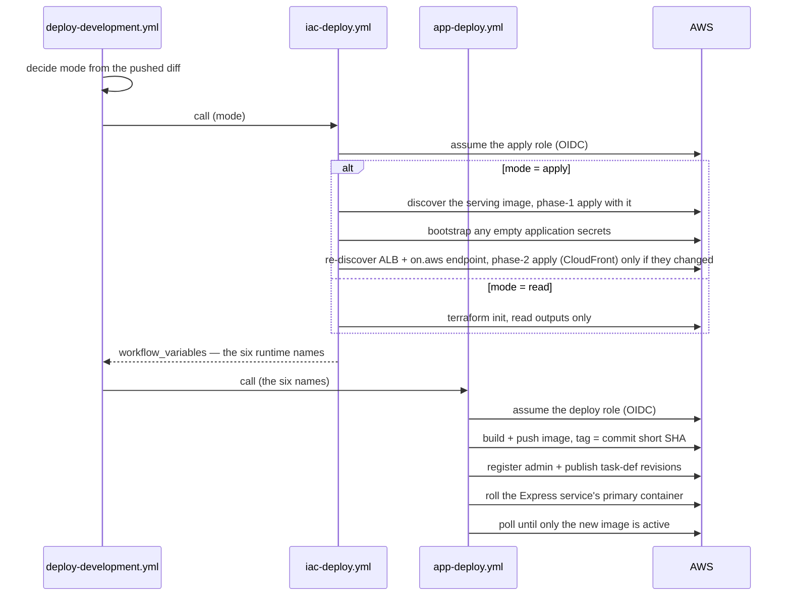
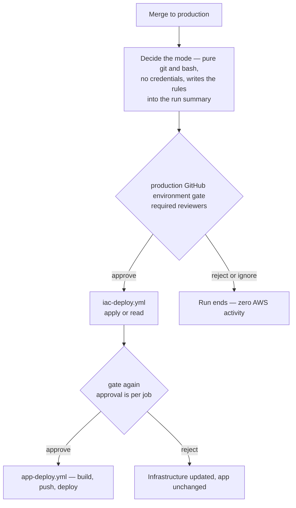

# Pipelines — from pull request to deployed

The pipelines are the GitHub Actions workflows that deploy MMGIS: on every merge they update the AWS infrastructure to match the code, then build and deploy the MMGIS admin app onto it. A *run* is one execution of a workflow — one row in the repo's Actions tab, with its jobs, logs, and summary. Three things can start one:

- an infrastructure pull request — gets a read-only plan preview (`iac-plan.yml`)
- a merge to `development` — runs that environment's deploy
- a merge to `production` — runs its deploy, with every step gated behind reviewer approval

The deploy logic is written once: `iac-deploy.yml` updates the infrastructure and `app-deploy.yml` builds and deploys MMGIS. Neither runs on its own — each environment branch has a small workflow that calls them in order, so adding a new environment means adding another small caller workflow, never duplicating the deploy logic.

## A deploy run, step by step

A push to `development` triggers `deploy-development.yml`; a push to `production` triggers `deploy-production.yml` — each file names its branch, and GitHub runs whichever one matches. A deploy run is that file executing three jobs, in order:

1. **Decide the mode** — not a separate file: a small job written inside the environment's own workflow, a bash script that runs `git diff` on the push and picks how much work the next job should do. Pure git, no AWS credentials.
2. **Infrastructure** (`iac-deploy.yml`) — brings the AWS environment up to date with the Terraform code, when that's needed. Whatever else it does, it always ends the same way: it reads six names out of Terraform state — region, ECR repository, cluster, service name, and the two task-definition families — the "where does this environment live" facts the next job needs.
3. **App** (`app-deploy.yml`) — takes those six names, builds the image from this commit, pushes it to ECR, and rolls the service onto it.

### The three modes

The workflow runs on every push to its branch. A human can also *dispatch* it — GitHub's term for starting a workflow by hand from the repo's Actions page — and the dispatch form offers one checkbox: "preview the infrastructure changes without applying or deploying anything." The mode-deciding job (step 1 above) looks at how the run started — a push and what it changed, or a dispatch and its checkbox — and outputs a single word, the *mode*, which sets what the other two jobs do:

| Mode | When | Infrastructure job | App job |
|---|---|---|---|
| `apply` | The push touched `infrastructure/terraform/**` or one of the three pipeline files; any dispatch without the preview box checked; any push where git cannot tell what changed (brand-new branch, or a force-push whose old commit is gone) — with no diff to check, the workflow plays safe and applies | Full apply, both phases ([environments](aws-environments.md#building-an-environment-takes-two-phases)), then read the six names | Runs |
| `read` | Every other push (app-only merges — most of them) | Read the six names out of state; touch nothing in AWS | Runs |
| `plan` | A dispatch with the preview box checked | Publish a plan to the run summary; apply nothing | Skipped |

The `plan` mode is not the plan preview pull requests get automatically — that is `iac-plan.yml` commenting on the PR ([below](#plan-previews-on-pull-requests)). This checkbox previews a deploy outside any PR: what would applying this branch's current head actually change — useful before an environment's first real apply, or to check for drift.

**Why the infrastructure job runs even on app-only merges:** skipping it looks obvious and does not work. A skipped GitHub Actions job emits no outputs, so the app job would receive six empty names on exactly the merges that touch no infrastructure — which is most of them. `read` mode is the fix: the job runs, touches nothing in AWS, and still hands over the names.

**One run at a time per environment.** Each trigger file declares a *concurrency group* — a GitHub feature: runs that share a label (`concurrency: group: deploy-development`) execute one at a time, and a newer run waits instead of cancelling the running one, because a run killed mid-apply would leave the Terraform state locked and the infrastructure half-updated. The label covers the whole run, all three jobs, so infrastructure and app work from two runs can never interleave; the two environments use different labels and never block each other. One GitHub quirk to know: at most one run waits per label — if merges stack up, only the newest keeps waiting and the middle ones are discarded. That is safe here, because a later push contains the earlier pushes' commits, so the run that does execute deploys everything.

### The run in detail

The same three jobs, with what each one actually says to AWS. Two steps in the diagram — "discover the serving image" and "bootstrap any empty application secrets" — get their own explanations right after.

### Which image runs, and who may change it

Two facts collide on every apply. First: the image reference is a field inside the Terraform-managed task definitions, so every apply must compute a value for it — and whenever that value differs from what is registered, the apply registers new revisions carrying it. Terraform, told nothing, falls back to `:latest`, a tag that never exists because CI pushes commit-SHA tags only. Second: each dashboard publish runs whatever image the newest publish revision names ([environments](aws-environments.md#images-and-task-definitions)). Put together: an apply left to its own devices would point the publish family at an image that resolves to nothing — and the next publish, possibly days later, would not even fail visibly. The image pull dies after the launch call the backend checks, so the deployment just sits in "provisioning" forever, with no error recorded and no deploy anywhere in sight to blame.

The design closes this with one rule — **the apply copies, the deploy moves**:

- Before applying, the infrastructure job asks ECS which image the service is serving right now, and applies with exactly that. An apply can rewrite the task definitions, but it can never change which build they name.
- The app job is the only writer of a *new* image reference, and it pushes the image to ECR before referencing it anywhere — it cannot name something that does not exist, because it just created what it names.

To see what this buys, follow a run that fails halfway. Commit #2 merges; the infrastructure job applies commit #2's Terraform, writing back the serving image — commit #1's. Then the app job's build breaks. Resting state: infrastructure at #2, the service still serving #1, the task definitions still naming #1 — an image that exists, because it is being served. The environment is *stale*, one commit of skew between infrastructure and app, but every image reference resolves and publishing keeps working. The red run tells a human to fix the build; nothing else happened. Without the lookup, the identical failure leaves the publish task definition naming `:latest` — nothing visibly breaks that day, and the damage surfaces at the next publish.

Three edge cases complete the rule:

- If a live service exists but its image cannot be determined, the infrastructure job **refuses to apply** rather than guess — a guess recreates exactly the failure above. (Production's dispatch form takes a `deployed_image` override for this case.)
- It refuses likewise if Terraform state says CloudFront exists but the three values CloudFront is built from (ALB ARN, endpoint, security group) cannot be read from the live service — applying anyway would tear the distribution down and bring it back on a new domain, changing the admin URL.
- On a brand-new environment there is no serving image to look up and nothing yet to protect, so the first apply knowingly registers the nonexistent placeholder; the service crash-loops for a few minutes until the app job later in the same run pushes the first real image and deploys it. If the new service's load balancer has not appeared by the end of the run, the CloudFront half simply stays unbuilt, and a later run completes it.

### Two more rules that hold on every run

**Nothing is written back into GitHub.** The six runtime names are read out of Terraform state at run time (`terraform output -json workflow_variables`) and handed to the app workflow as job outputs. Storing them in Actions variables instead would require a personal access token someone has to create and rotate by hand, and would leave a second copy of the truth free to drift from what Terraform actually built.

**No workflow ever touches database content.** Terraform manages the RDS *instance*, never what is in it; no workflow runs a migration, a seed, or a restore. The superadmin seed values only create an account on the database's first-ever boot.

## Generating the app's secrets (apply runs only)

Phase 1 of an apply ([environments](aws-environments.md#building-an-environment-takes-two-phases)) creates the Secrets Manager secrets as empty shells. Four of them hold credentials only MMGIS itself consumes — nobody outside the system needs to know them — so the infrastructure workflow generates a value for each one **the first time it finds the shell empty**, and never touches one that already has a value. Safety rules:

- "Is it empty?" is answered from `describe-secret` **metadata** only. No CI role has permission to read a secret's value, so CI can never read one back out.
- Values are passphrases of random words drawn from a published wordlist, downloaded at run time and verified against a hash committed in the workflow. If the download or the hash check fails, the run fails — there is no fallback to a weaker generator.
- A generated value flows through a pipe directly into `put-secret-value`; it is never stored in a shell variable, so no log or trace can print it.
- Two secrets are deliberately excluded: the Mapbox token (an external credential a human sets once) and the database password (RDS manages it; nothing here goes near it).

## Plan previews on pull requests

`iac-plan.yml` runs on every PR that touches `infrastructure/terraform/**` and posts one comment per environment root, updated in place on each push — the plan is the thing the reviewer actually reviews. It is read-only by construction:

- it signs in to the dedicated read-only plan role;
- it plans with `-lock=false`, so a preview can never block or wait on a real apply;
- it declares **no** GitHub environment — a job without one presents the `pull_request` identity the plan role trusts, and declaring one would make a mere PR check wait for production's reviewer approval (see [identity](identity.md#oidc-subjects-environment-vs-pull_request));
- it runs on `pull_request`, never `pull_request_target`, because it executes Terraform written by the PR's author and must never do so with write-scoped credentials.

Two expected situations produce a green check with an explanation rather than a failure: missing configuration (bootstrap not yet applied) skips AWS and posts a comment naming exactly which values are absent, and fork PRs — which receive no OIDC token and no comment-writing token on a public repo — get a notice in the job summary from a clearly labelled job.

## Production: every deploy needs approval

Merging to `production` expresses intent; it does not deploy.

The approval gate lives in the **shared workflows**, not in production's own workflow: both jobs declare `environment: production`, and that declaration is what makes GitHub ask for approval — so there is no path to AWS that bypasses it, manual dispatches included. Rules the run summary states on every run:

- **Two approval clicks per run is expected.** Required-reviewer approval is per job, and the app job only reaches the gate after the infrastructure job finishes. This is deliberately not "fixed": the same `environment:` declaration is also what gives each job the OIDC identity the production roles trust and the values stored in the production GitHub environment.
- **Approve the newest run only.** Runs waiting at the gate sit outside the concurrency group ("waiting", not "in progress"), so stale waiting runs accumulate; approving an older one deploys an older commit over a newer one.
- **No cross-environment image promotion.** Production builds its own image from the production-branch commit into production's own ECR repository. Development images are never reused for production — not by workflow, not by hand.

The GitHub environment's deployment-branch policy is a security control, not tidiness: without it, any workflow on any branch could declare `environment: production` and receive the OIDC identity the production roles trust.

## Rolling back

- **To roll back the app**, re-run the last green run from the Actions page. The app workflow rebuilds that commit from source, re-pushes the image under the same tag, and re-deploys. Same source is not the same bits: the rebuild re-resolves dependencies within their declared version ranges. (A run that decided `read` mode re-runs in `read` mode and changes no infrastructure.)
- **To roll back infrastructure**, merge a revert commit to the environment's branch and let the pipeline apply it. Hand-editing Terraform state is not a rollback — it is losing track of what exists.
- **When CI itself is broken**, an operator signs in to the apply role and runs the by-hand apply steps in the [infrastructure README](../../infrastructure/README.md#rollback-and-break-glass). Anything applied by hand counts as drift until a CI run applies the same committed change.

On production, every one of these paths waits at the same approval gate.

## Legacy: `deploy-lean.yml`

The older pipeline from before this split still deploys the existing staging environment from hand-set repository variables (different names from the `IAC_*` GitHub environment values, so neither pipeline can drive the other's environment).
