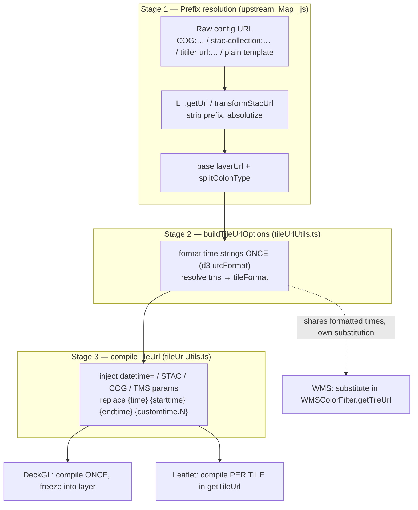

# Tile URL Pipeline

How a tile layer's raw config URL becomes a fully-substituted request URL, and
where the different rendering engines diverge.

This is the reference for [`tileUrlUtils.ts`](./tileUrlUtils.ts) and its callers.
Read it before changing time formatting, STAC/COG param injection, or anything
that touches `{time}` / `{customtime.N}` substitution.

## TL;DR

- **`buildTileUrlOptions`** formats every tile layer's time values **once**.
  Nothing bypasses it.
- **`compileTileUrl`** is the pure substituter. It assumes times are
  **already formatted** and never re-formats them.
- **Leaflet** runs `compileTileUrl` **per tile**; **DeckGL** runs it **once**
  and freezes the result. Same code, different cadence — not a bypass.
- **WMS** is the one genuine bypass of `compileTileUrl` (it substitutes in its
  own `getTileUrl`), but it still shares the formatted time values.
- The **3D globe** has a **third, separate formatter** that diverges slightly.

## The pipeline in stages

### Stage 1 — Prefix resolution (upstream of `tileUrlUtils`)

In `makeTileLayer`, [`Map_.js:1516-1575`](../Map_/Map_.js). The raw config URL is
run through `L_.getUrl` (`Map_.js:1516`), then a `sourceUrl.split(':')` switch
(`Map_.js:1519-1574`) branches on the prefix:

| Prefix            | What happens                                                        | Ref                    |
| ----------------- | ------------------------------------------------------------------- | ---------------------- |
| `stac-collection` | `L_.transformStacUrl(...)`, forces `tileformat='wmts'`              | `Map_.js:1527-1530`    |
| `COG`             | `ServiceUrls.buildTiTilerCogTilesUrl(...)`                          | `Map_.js:1532-1560`    |
| `titiler-url`     | strip prefix, absolutize                                            | `Map_.js:1562-1571`    |
| plain template    | falls through untouched                                             | —                      |

Output: a real base `layerUrl` **+ `splitColonType`** (the stripped prefix,
which `compileTileUrl` later keys off of). This is entirely upstream of
`tileUrlUtils.ts`.

> **Note:** `Map_.js:1584` calls `TimeControl.performTimeUrlReplacements(...)`
> before the engine branch. Despite the name, it does **not** substitute the
> `{time}` / `{starttime}` / `{endtime}` family into the tile template — that is
> Stage 3's job alone. It does two unrelated things
> (`TimeControl.js:417-471`):
>
> 1. **Custom variable URL replacements** (`:430-462`) — for layers configured
>    with `layer.variables.urlReplacements` where `on === 'timeChange'`. It
>    `fetch`es an **external API** and substitutes a user-defined `{key}`
>    placeholder with the response value (`:455-459`). The `{starttime}` /
>    `{endtime}` formatting here (`:442-451`) is applied only to the **fetch
>    request body**, not to the tile URL.
> 2. **Cache-busting** (`:464-468`) — appends `nocache=<timestamp>` when
>    `forceRequery === true`.
>
> At `Map_.js:1584` it's called with `forceRequery = null`, so for a plain tile
> layer with no `variables.urlReplacements` it's effectively a pass-through.
> It is **not** part of the `buildTileUrlOptions` / `compileTileUrl` pair — don't
> confuse it for Stage 3.

### Stage 2 — Option building (`buildTileUrlOptions`)

[`tileUrlUtils.ts:61-89`](./tileUrlUtils.ts). Formats the time strings **once**
via `formatLayerTime` (`tileUrlUtils.ts:34-44`, d3 `utcFormat`, empty string on
unparseable input), and resolves `tms → tileFormat` via `resolveTileFormat`
(`tileUrlUtils.ts:16-22`). Both engines call this.

> **Invariant** (`tileUrlUtils.ts:49-50`): the time strings on the returned
> object are **already formatted**. `compileTileUrl` substitutes them verbatim
> and never re-formats. Breaking this invariant re-introduces the double-format
> bug (see below).

> **Invariant** (`tileUrlUtils.ts:52-55`): the result is a **closed set**
> of tile-URL keys — nothing from the layer config is spread in. See "closed key set" below.

### Stage 3 — Substitution (`compileTileUrl`)

[`tileUrlUtils.ts:159-239`](./tileUrlUtils.ts). The pure substituter:

- STAC/COG/titiler `datetime=` injection — `:164-183`
- STAC `exitwhenfull` / `skipcovered` — `:185-187`
- COG params via `applyCogFieldsToUrl` — `:189`
- global STAC mosaic limits — `:194-202`
- `{time}` / `{starttime}` / `{endtime}` replacement — `:205-208`
- `{customtime.N}` replacement — `:210-218`
- TMS `starttime` / `time` / `composite` params — `:220-236`

Time placeholders are always replaced, even when the value is `''` (no time
configured, or times not yet resolved): `https://t/{time}.png` becomes
`https://t/.png`, not a literal `{time}` the tile server would reject. The
substitution reads the layer's URL template each time, so an emptied URL is
never sticky — the next compile with real times fills them in.

## The three call sites

| Engine       | Cadence               | Creation                        | Time-change                                             |
| ------------ | --------------------- | ------------------------------- | ------------------------------------------------------- |
| **DeckGL**   | compile **once**      | `Map_.js:1596-1611`             | rebuild URL: `TimeControl.js:301-302`                   |
| **Leaflet**  | compile **per tile**  | `Map_.js:1618-1634`             | `tileLayer.refresh(...)`: `TimeControl.js:299`          |
| **WMS**      | own substitution      | `middleware.js:288-315`         | reads shared `this.options` times                       |

### DeckGL — resolves once, eagerly

`Map_.js:1596-1599`. Deck needs a complete static URL upfront (no per-tile
hook), so `compileTileUrl` runs a single time at layer creation and the baked
URL is frozen into the deck layer (`Map_.js:1602-1611`). On a time change the
layer's URL is rebuilt — `TimeControl.js:301-302` (`compileTileUrl` →
`Map_.engine.updateLayer`).

### Leaflet ColorFilter — resolves lazily, per tile

`buildTileUrlOptions` output is spread into `this.options` at creation
(`Map_.js:1618-1634`), but `compileTileUrl` runs inside `getTileUrl` —
[`leaflet-tilelayer-middleware.js:21-24`](./leaflet-tilelayer-middleware.js) —
once per tile fetch, **after** Leaflet has already substituted `{z}/{x}/{y}`. On
a time change, `refresh(newUrl, force, updateOptions)`
(`middleware.js:106-127`) merges new values into `this.options` (`:107-110`)
and `this._url` (`:113`); the next `getTileUrl` per tile picks them up.

### Why `buildTileUrlOptions` returns a closed key set

`refresh()` copies **every** key it is handed onto `this.options`, and
`this.options` also holds Leaflet's own creation options — several of which are
not plain copies of the layer config: `bounds` is an `L.latLngBounds` built from
`boundingBox`, `tms` comes from the resolved tile format rather than
`layerObj.tms`, `minZoom`/`maxZoom`/`maxNativeZoom` are `parseInt`'d, and
`continuousWorld`/`reuseTiles` are constants. So `buildTileUrlOptions` returns
only the keys `compileTileUrl` reads and never spreads the layer config — that is
what lets both creation and `refresh()` take the object whole. **Add a new
tile-URL option there and nowhere else**; both paths then pick it up.

### `TimeControl.reloadLayer` — the time-change entry point

[`TimeControl.js:218`](../TimeControl_/TimeControl.js). Re-runs
`buildTileUrlOptions` (`:289`) then dispatches: Leaflet via
`tileLayer.refresh(...)` (`:299`), Deck via `compileTileUrl` +
`updateLayer` (`:301-302`). The Deck branch does not return early — both
branches fall through to a shared tail that restores `layer.url` to the
pre-substitution original.

> Deck and Leaflet run **identical** code, differing only in cadence
> (frozen-once vs per-tile). This is by design, not a bypass.

## The one genuine bypass: WMS

`L.tileLayer.colorFilter` (`middleware.js:288-315`): if `tileFormat === 'wms'`
it constructs a `WMSColorFilter` (`:310`). That class's `getTileUrl`
(`middleware.js:204-260`) does its own `{time}` / `{starttime}` / `{endtime}` /
`{customtime.N}` substitution against `this.wmsParams` (`:220-248`) and **never
calls `compileTileUrl`** — a parallel substitution path.

It is **not fully divorced**, though: it still reads
`this.options.time` / `.starttime` / `.endtime` (`middleware.js:226-228`), which
came from `buildTileUrlOptions` at creation. So the **formatted time values are
shared** — only the substitution mechanism is duplicated. A WMS layer won't get
out of sync on time formatting; it just won't pick up `compileTileUrl`'s
STAC/COG/TMS param logic — which is correct, WMS doesn't want those.

## The third formatter: the 3D globe

The globe path [`GlobeRenderer.js:776-810`](../Globe_/GlobeRenderer.js) has its
own `d3.utcFormat` block. **Known divergence:** it **re-formats `customTimes`** —
`timeFormat(Date.parse(customTimes.times[i]))` at `:803-805`. The `tileUrlUtils`
path does not — `buildTileUrlOptions` passes `customTimes` through raw
(`tileUrlUtils.ts:76`) and `compileTileUrl` substitutes them verbatim
(`:210-218`). So `{customtime.N}` gets d3-formatted on the globe but injected
as-is on Leaflet/Deck. This is a tracked follow-up ("third formatter"), separate
from the `tileUrlUtils` flow.

## Invariant: format once, substitute verbatim

Time values are formatted exactly once, in `buildTileUrlOptions`. `compileTileUrl`
is a **pure substituter** — it injects the already-formatted strings and never
parses or re-formats them. This matters because Leaflet calls `compileTileUrl`
per tile: if formatting lived there it would re-bite on every tile fetch and shift
dates across timezones, while DeckGL's single URL bake would hide it. **Do not
re-introduce formatting into `compileTileUrl`.**
