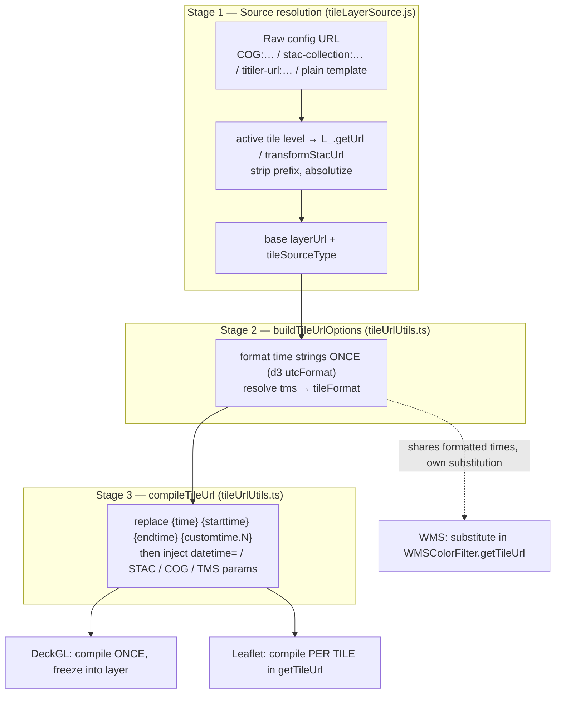

# Tile URL Pipeline

How a tile layer's raw config URL becomes a fully-substituted request URL, and
where the different rendering engines diverge.

This is the reference for [`tileUrlUtils.ts`](./tileUrlUtils.ts),
[`tileLayerSource.js`](./tileLayerSource.js) and their callers. Read it before
changing time formatting, STAC/COG param injection, or anything that touches
`{time}` / `{customtime.N}` substitution.

> References below name files and functions rather than line numbers, which rot.

## TL;DR

- **`resolveTileLayerSource`** turns a layer config into its base URL. Creation
  and time-driven reload both call it, so they cannot resolve to different
  sources.
- **`buildTileUrlOptions`** formats a tile layer's time values **once**.
  `setLayerWmsParams` writes the same values through the same formatter.
- **`compileTileUrl`** is the pure substituter. It assumes times are
  **already formatted** and never re-formats them.
- **Leaflet** runs `compileTileUrl` **per tile**; **DeckGL** runs it **once**
  and freezes the result. Same code, different cadence — not a bypass.
- **WMS** is the one genuine bypass of `compileTileUrl` (it substitutes in its
  own `getTileUrl`), but it still shares the formatted time values.
- The **3D globe** has a **third, separate formatter** that diverges slightly.

## The pipeline in stages

### Stage 1 — Source resolution (`resolveTileLayerSource`)

[`tileLayerSource.js`](./tileLayerSource.js). Picks the active tile level's URL
(falling back to `layerObj.url`), runs it through `L_.getUrl`, then branches on
the service prefix:

| Prefix            | What happens                                              |
| ----------------- | --------------------------------------------------------- |
| `stac-collection` | `L_.transformStacUrl(...)`, resolves `tileFormat: 'wmts'` |
| `COG`             | `ServiceUrls.buildTiTilerCogTilesUrl(...)`                |
| `titiler-url`     | strip prefix, absolutize against `L_.missionPath`         |
| plain template    | falls through untouched                                   |

Output: a real base `url`, the `tileSourceType` (the stripped prefix, which
`compileTileUrl` later keys off of), the tile level's `tileElevation`, and the
resolved `tileFormat` (forced to `wmts` for `stac-collection` sources).

> The resolver is **pure**. The `layerObj.tileFormat` write for stac layers is
> a separate step — `syncTileFormatToConfig`, called at creation — for the
> readers that consume the config directly (globe setup, IdentifierTool). The
> pipeline itself threads `tileFormat` through `buildTileUrlOptions` and never
> reads that write.

> **Both** `Map_.makeTileLayer` and `TimeControl.reloadLayer` call this. They
> used to each carry their own copy of the logic, and the reload copy silently
> dropped the tile-level selection — a time change would swap the layer back to
> its default source. Keep this single implementation.

> **Note:** `makeTileLayer` calls
> `TimeControl.applyUrlReplacementsAndCacheBust(...)` before the engine branch.
> It does two things, neither of which is time-token substitution — the
> `{time}` / `{starttime}` / `{endtime}` family is Stage 3's job alone:
>
> 1. **Custom variable URL replacements** — for layers configured with
>    `layer.variables.urlReplacements` where `on === 'timeChange'`. It `fetch`es
>    an **external API** and substitutes a user-defined `{key}` placeholder with
>    the response value. The `{starttime}` / `{endtime}` formatting here is
>    applied only to the **fetch request body**, not to the tile URL.
> 2. **Cache-busting** — appends `nocache=<timestamp>` when
>    `forceRequery === true`.
>
> At creation it's called with `forceRequery = null`, so for a plain tile layer
> with no `variables.urlReplacements` it's effectively a pass-through. It is
> **not** part of the `buildTileUrlOptions` / `compileTileUrl` pair.

### Stage 2 — Option building (`buildTileUrlOptions`)

[`tileUrlUtils.ts`](./tileUrlUtils.ts). Formats the time strings **once** via
`formatLayerTime` (d3 `utcFormat`, empty string on unparseable input), takes the
`tileFormat` resolved in Stage 1 (falling back to `resolveTileFormat` on the
layer config), and captures the global STAC mosaic limits from
`mmgisglobal.options.stac` — the one environmental read in the pipeline, kept
here so `compileTileUrl` stays a closed function of its arguments. Both engines
call this.

`TimeControl.setLayerWmsParams` writes `options.time` / `.starttime` / `.endtime`
directly onto an existing Leaflet layer rather than going through
`buildTileUrlOptions`, but it uses the same `formatLayerTime`, so the values
agree.

> **Invariant:** the time strings on the returned object are **already
> formatted**. `compileTileUrl` substitutes them verbatim and never re-formats.

> **Invariant:** the result is a **closed set** of tile-URL keys — nothing from
> the layer config is spread in. See "closed key set" below.

### Stage 3 — Substitution (`compileTileUrl`)

[`tileUrlUtils.ts`](./tileUrlUtils.ts). The pure substituter, in order:

1. `{time}` / `{starttime}` / `{endtime}` and `{customtime.N}` replacement
2. STAC/COG/titiler `datetime=` injection, STAC `exitwhenfull` / `skipcovered`,
   COG params via `applyCogFieldsToUrl`, the STAC mosaic limits captured by
   `buildTileUrlOptions` (never read from globals here)
3. TMS `starttime` / `time` / `composite` params

**Step 1 must stay ahead of step 2.** `applyCogFieldsToUrl` round-trips the
whole query string through `URLSearchParams`, which percent-encodes braces —
`{time}` becomes `%7Btime%7D` and no longer matches the replacement. Leaflet
masks this for the three standard tokens (`L.Util.template` substitutes them
from `this.options` before `compileTileUrl` is reached); DeckGL has no such
step, so with the old ordering a placeholder inside a query string reached the
server raw.

Time placeholders are always replaced, even when the value is `''` (no time
configured, or times not yet resolved): `https://t/{time}.png` becomes
`https://t/.png`, not a literal `{time}` the tile server would reject. The
substitution reads the layer's URL template each time, so an emptied URL is
never sticky — the next compile with real times fills them in.

## The three call sites

| Engine      | Cadence              | Creation                  | Time-change                             |
| ----------- | -------------------- | ------------------------- | --------------------------------------- |
| **DeckGL**  | compile **once**     | `Map_.makeTileLayer`      | rebuild URL + `Map_.engine.updateLayer` |
| **Leaflet** | compile **per tile** | `Map_.makeTileLayer`      | `tileLayer.refresh(...)`                |
| **WMS**     | own substitution     | `L.tileLayer.colorFilter` | reads shared `this.options` times       |

### DeckGL — resolves once, eagerly

Deck needs a complete static URL upfront (no per-tile hook), so `compileTileUrl`
runs a single time at layer creation and the baked URL is frozen into the deck
layer. On a time change `TimeControl.reloadLayer` rebuilds the URL and calls
`Map_.engine.updateLayer`.

### Leaflet ColorFilter — resolves lazily, per tile

`buildTileUrlOptions` output is spread into `this.options` at creation, but
`compileTileUrl` runs inside `getTileUrl` —
[`leaflet-tilelayer-middleware.js`](./leaflet-tilelayer-middleware.js) — once
per tile fetch, **after** Leaflet has already substituted `{z}/{x}/{y}`. On a
time change, `refresh(newUrl, force, updateOptions)` merges new values into
`this.options` and `this._url`; the next `getTileUrl` per tile picks them up.

#### `refresh()` re-applies the creation-time URL normalization

`L.tileLayer.colorFilter` does two things to a URL that a plain assignment to
`_url` would skip, so `refresh()` repeats them:

- **`{t}`** — a documented shorthand time placeholder. `L.Util.template` throws
  on any `{token}` it can't resolve from options, so `normalizeTileUrlTemplate`
  rewrites it to an inert `_time_` first. A `_url` carrying a raw `{t}` throws
  on every subsequent tile fetch.
- **the WMS base/params split** — a WMS layer keeps only the base address in
  `_url`; the query params live in `wmsParams` and are re-appended per tile.
  `wmsExtension.refresh` re-splits an incoming URL rather than assigning it
  whole, which would send every param twice. The split is **merge-only**:
  params in the incoming URL are added or overwritten, but a param the URL no
  longer carries is not removed from `wmsParams` and keeps being sent.

### Why `buildTileUrlOptions` returns a closed key set

`refresh()` copies **every** key it is handed onto `this.options`, and
`this.options` also holds Leaflet's own creation options — several of which are
not plain copies of the layer config: `bounds` is an `L.latLngBounds` built from
`boundingBox`, `tms` comes from the resolved tile format rather than
`layerObj.tms`, `minZoom`/`maxZoom`/`maxNativeZoom` are `parseInt`'d, and
`continuousWorld`/`reuseTiles` are constants. So `buildTileUrlOptions` returns
only the keys `compileTileUrl` reads and never spreads the layer config — that is
what lets both creation and `refresh()` take the object whole. **Add a new
tile-URL option there and nowhere else**; both paths then pick it up.

### `TimeControl.reloadLayer` — the time-change entry point

[`../TimeControl_/TimeControl.js`](../TimeControl_/TimeControl.js). Re-runs
`resolveTileLayerSource` and `buildTileUrlOptions`, then dispatches: Leaflet via
`tileLayer.refresh(...)`, Deck via `compileTileUrl` + `updateLayer`. The Deck
branch does not return early — both branches fall through to a shared tail that
restores `layer.url` to the pre-substitution original.

> Deck and Leaflet run **identical** code, differing only in cadence
> (frozen-once vs per-tile). This is by design, not a bypass.

## The one genuine bypass: WMS

`L.tileLayer.colorFilter`: if `tileFormat === 'wms'` it constructs a
`WMSColorFilter`. That class's `getTileUrl` does its own `{time}` /
`{starttime}` / `{endtime}` / `{customtime.N}` substitution against
`this.wmsParams` and **never calls `compileTileUrl`** — a parallel substitution
path. It also replaces only the **first** occurrence of each of the three
standard tokens per param (non-global `String.replace`), where `compileTileUrl`
replaces all.

It is **not fully divorced**, though: it still reads `this.options.time` /
`.starttime` / `.endtime`, which came from `buildTileUrlOptions` at creation. So
the **formatted time values are shared** — only the substitution mechanism is
duplicated. A WMS layer won't get out of sync on time formatting; it just won't
pick up `compileTileUrl`'s STAC/COG/TMS param logic — which is correct, WMS
doesn't want those.

## The third formatter: the 3D globe

The globe path [`../Globe_/GlobeRenderer.js`](../Globe_/GlobeRenderer.js) has
its own `d3.utcFormat` block. **Known divergence:** it **re-formats
`customTimes`** — `timeFormat(Date.parse(customTimes.times[i]))`. The
`tileUrlUtils` path does not — `buildTileUrlOptions` passes `customTimes`
through raw and `compileTileUrl` substitutes them verbatim. So `{customtime.N}`
gets d3-formatted on the globe but injected as-is on Leaflet/Deck. This is a
tracked follow-up ("third formatter"), separate from the `tileUrlUtils` flow.

## Invariant: format once, substitute verbatim

Time values are formatted exactly once, in `buildTileUrlOptions`.
`compileTileUrl` is a **pure substituter** — it injects the already-formatted
strings and never parses or re-formats them. This is a design guarantee, not a
fix for a past bug: Leaflet calls `compileTileUrl` per tile, so if formatting
lived there it would re-bite on every tile fetch and shift dates across
timezones, while DeckGL's single URL bake would hide it. **Do not introduce
formatting into `compileTileUrl`.**
